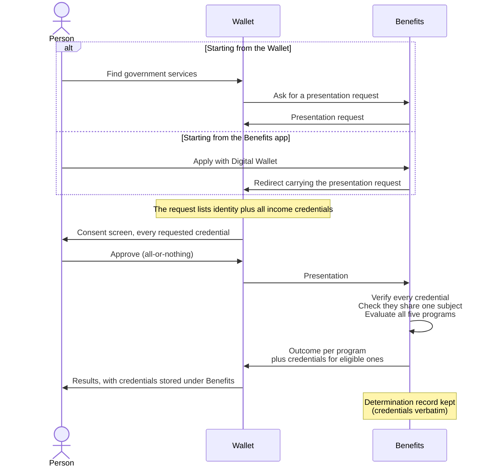

# Credential Model

How credentials work across the three apps: who issues and verifies what, the flow the demo is
building towards, the claims each credential carries, and how closely it follows the W3C
standard. Written for GitHub issue #21.

Aligned with the **W3C VC Data Model 2.0**, secured as a JWT per **VC-JOSE-COSE** — a subset of
the standard, never contrary to it (see `docs/decisions.md`). Eligibility rules live in
[docs/benefit-programs.md](benefit-programs.md).

## 1. Target flow

This is the flow the demo is **eventually** meant to support, written before any of it is
built. Loops 2–6 each implement a slice of it; the loop column below says which. Where a loop
will build less than what is described, that is a deliberate subset, not a change of direction.

### Roles

| Party | App | Role in the flow |
|---|---|---|
| The public user | Wallet | **Holder** — receives, stores and presents credentials. The only party that ever holds all of a person's credentials. |
| A state (New Jersey, Michigan, New York, Ohio) | none | **Issuer** of identity credentials. Not an app: identity credentials exist before the demo starts. |
| Meridian Payroll | Payroll | **Verifier** of identity, then **issuer** of income credentials. |
| The Benefits provider | Benefits | **Verifier** of identity and income, then **issuer** of benefit credentials. |

Every credential about a person carries the same **subject identifier** — a `urn:uuid:` per
person. It is the thread that ties their identity, income and benefit credentials together, and
the thing a verifier checks for consistency across a set of credentials. It names the person;
it does not prove the presenter *is* that person (see holder binding, #25).

### Overview

| Phase | What happens | Built in |
|---|---|---|
| 0. Identity exists | The person already holds a state-issued identity credential | Loop 2 (#12) |
| 1. Find employer | The person records their employer in the Wallet | Loop 4 (#13) |
| 2. Connect to Payroll | Payroll verifies the person's identity and links them to their employee record | Loop 4 (#16, #22) |
| 3. Receive income credentials | Payroll issues one credential per paystub; the Wallet stores them | Loop 5 (#19) |
| 4. Apply for benefits | From the Wallet or the Benefits app: Benefits verifies identity and income, decides all five programs, issues credentials for the eligible ones | Loop 6 |
| 5. Present a benefit credential | The person opens a benefit credential in the Wallet and presents it to someone else | Not yet scheduled |

### Phase 0 — Identity exists

The person's state issued their identity credential before the demo begins. Nothing in the
demo performs this issuance: in Loop 2 the credentials are generated once and loaded into the
Wallet (#12).

Per the sample data (#6), 21 people hold a valid credential — 18 from New Jersey and one each
from Livonia (Wayne County, Michigan), Astoria (Queens County, New York) and Cleveland
(Cuyahoga County, Ohio) — 2 hold a **tampered** one, and 2 hold **none**. On receipt and on
display, the Wallet verifies each credential's signature against its issuer's public key and
shows a Verified or Tampered badge.

> In a deployed system a wallet verifies a credential when it receives it and would reject a
> tampered one rather than keep it. Holding and badging a tampered credential is a demo device
> that makes an invisible cryptographic check visible on screen.

### Phase 1 — Find employer

1. The person chooses **Find your employer** in the Wallet and picks from the list of demo
   employers.
2. The Wallet records the employment relationship, including which payroll provider serves that
   employer (for every demo employer, Meridian Payroll) and where to reach it.
3. The employer appears on the Connections screen with a **Connect payroll** button. The
   Activity log records the new connection.

No credential moves in this phase. It establishes *where* the Wallet will send a request.

### Phase 2 — Connect to Payroll

Payroll needs to know that the person connecting is really one of its employees before it will
issue anything to them.

**Assumption:** when an employer signed up with Meridian Payroll, its employees' identities
were verified as part of that onboarding, so Payroll already knows each employee's subject
identifier. The demo does not show that onboarding; Payroll's sample employee records simply
carry each person's subject identifier.

1. The person taps **Connect payroll**. The Wallet sends a connection request to Payroll.
2. Payroll replies with a **presentation request**: a list of the credentials it needs and,
   within each, the claims it needs. For Payroll the list has one entry — the identity
   credential — but it is a list, because later verifiers ask for several.
3. The Wallet shows the **consent screen** (#22): each requested credential, with **every claim
   it contains** listed under it and the ones the requester needs marked. A signed credential is
   shared whole, so the screen shows everything that will actually be handed over (§3).
   Approval is **all-or-nothing** over the whole request.
   - **Deny** — nothing is shared, and the Wallet returns to its previous state.
   - **Approve** — the Wallet sends a **presentation** containing the requested credential.
4. Payroll **verifies** the presented credential: the signature checks out against the issuing
   state's public key, and the credential is within its validity period.
5. Payroll **links** the connection to the employee record whose subject identifier matches the
   credential's subject. It does not create an account — the employee record already exists.
6. Payroll confirms the connection. The Wallet marks Payroll as connected on the Connections
   screen and records it in the Activity log.

Verification does real work at two points: the signature has to check out (step 4), **and** the
subject has to be someone Payroll already employs (step 5).

**When it fails:**

- **Tampered identity** — verification fails at step 4. Payroll refuses the connection, and the
  Wallet tells the person their identity credential could not be verified.
- **No identity credential** — the Wallet cannot satisfy the request at step 3. It shows that a
  required credential is missing rather than offering an Approve button that cannot work. This
  is reachable in **Loop 4**, not only later: the two people with no identity credential hit it
  the first time they connect. Without a connection they never receive income credentials.
- **Not an employee** — the credential verifies but no employee record carries its subject.
  Payroll refuses: the person is who they say they are, but not an employee.

### Phase 3 — Receive income credentials

1. When the Wallet opens for a person, it asks each connected service for any credentials it
   has not yet received.
2. Payroll issues **one credential per paystub**, each naming the person's subject identifier
   as its subject.
3. The Wallet verifies each on receipt, stores it, and shows it under the **Income** category.
   The Activity log records what arrived.

Two paystubs per employer per month, so a person with three employers receives six income
credentials from the same issuer.

### Phase 4 — Apply for benefits

There are **two ways in**, and they converge at the presentation request. From that point on
the flow is identical.

- **From the Wallet.** The Wallet has a **Find government services** button listing the
  services it knows about and where to reach them — a *services directory*, built as a list the
  way the employer list is. It has one entry today (Benefits); in a fuller world it would list
  many agencies, each offering its own programs. Choosing Benefits makes the Wallet ask
  Benefits for its presentation request directly. **The person never has to visit the Benefits
  app.**
- **From the Benefits app.** The Benefits app offers two options side by side:
  - **Apply here** — disabled, with the note *"Applying without a digital wallet isn't
    available yet."*
  - **Apply with Digital Wallet** — sends the person to the Wallet carrying Benefits'
    presentation request, where the Wallet's currently selected person responds. Under it:
    *"Using your digital wallet uses info from your wallet to make applying fast and
    secure."*



1. The person starts an application, from either entry point. **Every application covers all
   five programs** — there is no choosing among them.
2. Benefits' **presentation request** asks for the identity credential **and every income
   credential** — a list with several entries, which is why the request was a list from Phase 2.
3. The Wallet shows the consent screen. Approval is all-or-nothing.
4. The Wallet sends a presentation containing all the requested credentials.
5. Benefits **verifies** every credential against its issuer's key, and checks that they all
   name the **same subject** — an income credential about someone else must not count toward
   this person's income.
6. Benefits **evaluates all five programs** in one pass (docs/benefit-programs.md): residency
   from the identity credential's `address.addressRegion`, county from its `address.county`,
   and income summed from the
   gross pay on the income credentials.
7. Benefits returns an **outcome for every program** — eligible or denied, possibly with a
   reason — and a **benefit credential for each eligible one**. The per-program outcome is plain
   protocol data, not a credential.
8. The Wallet stores the benefit credentials under the **Benefits** category and records every
   outcome in the Activity log, **denials included** — a denial produces no credential, so the
   log is the only place the person sees it afterwards.
9. Once the person holds benefit credentials, the Wallet **stops offering Find government
   services** and shows the credentials in its place. There is no re-applying.
10. Benefits keeps a **determination record**: the presented credentials verbatim, the derived
    figures it used, the subject identifier and the outcomes. There is no applicant-facing view
    of it; it exists for a future admin view (see `docs/decisions.md`).

**When it fails:** a tampered identity credential fails verification at step 5 and every
program is denied. A person with no identity credential cannot satisfy the request at step 3.
Out-of-state identities verify successfully but fail the residency test at step 6. In all three
cases the person holds no benefit credentials afterwards, so Find government services stays
available and they can apply again — getting the same answer. That is acceptable, and nothing
is built to prevent it.

### Phase 5 — Present a benefit credential

Not yet scheduled. The reason benefit credentials exist is so the person can prove eligibility
to someone else — a utility company applying an Energy discount, say. The Wallet will let the
person open a benefit credential and present it. No app in the demo asks for one yet, so the
verifier on the other side of this phase is undefined.

### Deliberately out of the target flow

- **Re-applying or renewing.** Once a person holds benefit credentials there is no path back to
  applying. People denied everything can apply again, but nothing reconciles repeated
  applications.
- **Revocation.** A credential, once issued, stays valid until it expires (see §5).
- **Holder binding.** Presentations are unsigned, so nothing proves the presenter is the
  credentials' subject. A subset of the standard, not a contradiction of it; deferred to #25.

### Decisions made in review

Settled on 2026-09-18, and reflected in the phases above:

1. **Payroll already knows each employee's subject identifier**, on the assumption that
   identities were verified when the employer joined Meridian Payroll. Payroll links to an
   existing employee record rather than creating an account.
2. **Subject identifiers are `urn:uuid:`.** A DID would only earn its keep with holder binding;
   #25 records switching to `did:key` if that is ever built.
3. **Holder binding is deferred** — #25, labelled `deferred`.
4. **Every application covers all five programs.**
5. **Two entry points to applying**, converging at the presentation request: Find government
   services in the Wallet, and Apply with Digital Wallet on the Benefits app.

## 2. Trust — issuers, keys and verification

A credential is trustworthy when three things hold: it was signed by the issuer it names, that
issuer is one the verifier trusts, and the issuer is trusted *for that kind of credential*.
This section says who the issuers are, where their keys live, and how an app checks all three.

### Issuers

| Issuer | Issues | Signs when | Private key lives |
|---|---|---|---|
| State of New Jersey | Identity credentials | Once, before any demo | Your machine, outside git |
| State of Michigan | Identity credentials | Once, before any demo | Your machine, outside git |
| State of New York | Identity credentials | Once, before any demo | Your machine, outside git |
| State of Ohio | Identity credentials | Once, before any demo | Your machine, outside git |
| Meridian Payroll | Income credentials | During the demo (Loop 5) | Render environment variable |
| Benefits | Benefit credentials | During the demo (Loop 6) | Render environment variable |

The states sign only when the identity credentials are generated; the signed credentials are
then committed and deployed like any other seed data. **No machine outside Render is involved
while a demo runs.**

Every key pair uses **ES256** (ECDSA on the P-256 curve) — the most widely supported algorithm
in the JOSE family that VC-JOSE-COSE builds on.

### Issuer identifiers

The VC's `issuer` is an object with an `id` (a URI) and a display `name`:

- **Payroll and Benefits** use their own deployed origins, e.g.
  `https://cred-demo-payroll.onrender.com`. They control those addresses, so the identifier is
  honest, and each can publish its public key there (see Keeping keys in step).
- **The states** have no app and no address the demo controls. They use
  `did:example:state-of-new-jersey` and so on. `did:example` is the method the W3C specs
  themselves reserve for illustration, so it is syntactically valid, self-evidently fictional,
  and never resolves anywhere. Using a real government domain such as `nj.gov` would
  misrepresent a real agency as the issuer.

### Trust lists

Each app that verifies credentials keeps **its own copy** of a trust list, per the monorepo
rule. An entry names the issuer, its public keys, and the **credential types it is trusted
for**:

```json
{
  "did:example:state-of-new-jersey": {
    "name": "State of New Jersey",
    "trustedFor": ["IdentityCredential"],
    "keys": [ { "kty": "EC", "crv": "P-256", "kid": "nj-1", "x": "…", "y": "…" } ]
  }
}
```

`trustedFor` matters: Payroll's key must not be accepted on an identity credential, and a
state's key must not be accepted on a paystub. A correctly signed credential from the wrong
kind of issuer is still rejected.

Who trusts whom:

| App | Trusts | Because it verifies |
|---|---|---|
| Wallet | All six issuers | Everything it receives and displays |
| Payroll | The four states | Identity, when a person connects (Phase 2) |
| Benefits | The four states and Payroll | Identity and income, when a person applies (Phase 4) |

Nothing needs to trust Benefits except the Wallet, until a Phase 5 verifier exists.

### Verification

Every verifying app runs the same checks, in this order, stopping at the first failure:

1. **Known issuer** — the credential's `issuer.id` is in the trust list.
2. **Trusted for this type** — the issuer's `trustedFor` includes the credential's type.
3. **Signature** — the JWT's `kid` names one of that issuer's keys, and the signature verifies
   against it.
4. **Validity window** — the current time is within `validFrom` and, if present,
   `validUntil`.

Verifiers receiving a *presentation* then add:

5. **One subject** — every credential in the presentation names the same subject identifier.
6. **Known subject** — Payroll only: the subject belongs to an existing employee record.

The order matters for what the person is told: an unknown issuer is not the same failure as a
broken signature, and an expired credential is not a forged one. What each failure looks like
on screen is §5.

### Key custody

| Where | Holds | In git? |
|---|---|---|
| Each app's trust list | Public keys | Yes — public keys are safe to publish |
| Committed seed data | Signed identity credentials, including the deliberately tampered ones | Yes — signatures are public by design |
| A local `keys/` folder on your machine | The four states' private keys | **No** — gitignored |
| Render environment variables | Payroll's and Benefits' private keys | **No** — set with `sync: false` in `render.yaml` |
| A local `.env` in `apps/payroll` and `apps/benefits` | The same keys, for running locally | **No** — gitignored; a committed `.env.example` shows the variable names |
| Tests | Throwaway keys generated at test time | Never real keys — CI has none and needs none |

The repository is public. Committing a private key would let anyone mint credentials that every
app in the demo would accept.

### Keys are disposable

Keys living only on one machine would be a liability if that machine were lost. Instead, **one
script regenerates everything**: new key pairs for all six issuers, freshly signed identity
credentials (tampered ones included), and every app's trust list. It prints the new Payroll and
Benefits private keys for pasting into Render. Losing the keys costs one run of the script and
a commit, not a reconstruction.

There is no key *rotation* beyond that: regenerating invalidates every credential signed with
the old keys. In a demo whose runtime state is reset whenever a service idles (#27), that is
acceptable.

### Keeping keys in step

A private key held in Render must match the public key committed in the other apps' trust
lists. If someone replaced Payroll's key in Render and forgot the trust lists, every credential
Payroll issued would show as **Tampered** — a configuration slip that looks like a
cryptography bug. Two guards:

- **Startup self-check.** Payroll and Benefits each commit their own public key alongside their
  code. On startup, each derives the public key from its private key and compares; on a
  mismatch, `/health` reports unhealthy with a message saying so, rather than the app quietly
  issuing credentials nothing will accept.
- **Published keys.** Each issuing app serves its public keys at `/.well-known/jwks.json`, the
  standard JOSE location, so a mismatch can be diagnosed by looking rather than guessing. It is
  also the first step towards verifiers looking keys up instead of hard-coding them.

### Decisions made in review

Settled on 2026-09-18:

1. **The regeneration script is allowed.** It is a one-shot generator under `tools/`, run by
   hand, with committed output, and nothing runs it at build or deploy time. That is distinct
   from the "no sync script" rule, which exists to rule out tooling that *keeps* copies aligned
   (it originated in a rejected proposal to sync `cred.css`). Recorded in `docs/decisions.md`;
   the same allowance covers the sample data generator (#6).
2. **The states are `did:example:` issuers.** Nothing in the demo may give the impression that
   any service in it is a real government service — now a product rule in `docs/decisions.md`.

## 3. Claim schemas

Three credential types. Names, addresses and figures in the examples below are illustrative,
not the sample data — #6 supplies that.

### The common envelope

Every credential is a VC Data Model 2.0 document, and the JWT's payload **is** that document
(VC-JOSE-COSE), not a wrapper around it:

```json
{
  "@context": ["https://www.w3.org/ns/credentials/v2"],
  "id": "urn:uuid:5a0c…",
  "type": ["VerifiableCredential", "IdentityCredential"],
  "issuer": { "id": "did:example:state-of-new-jersey", "name": "State of New Jersey" },
  "validFrom": "2026-01-15T00:00:00Z",
  "validUntil": "2030-01-15T00:00:00Z",
  "credentialSubject": { "id": "urn:uuid:9e41…", "…": "…" }
}
```

- **`id`** — every credential gets its own `urn:uuid:`. It is what lets the Wallet ask Payroll
  only for credentials it hasn't received (Phase 3), and what Benefits' determination record
  refers to.
- **`type`** — the second entry is the credential's class, and the only thing the apps use to
  tell credentials apart.
- **`credentialSubject.id`** — the person's subject identifier, identical across all of their
  credentials.
- **`validFrom` / `validUntil`** — the validity window. Values per type are §5.
- **`@context`** — only the base VC 2.0 context. Our own terms (`county`, `grossPay`, …) are not
  yet defined in a context of our own; whether to publish one is §4.

The JWT header carries `alg: ES256`, the `kid` of the signing key (§2), and `typ: vc+jwt`.

### Identity credential

Issued by a state. Proves who the person is and where they live.

```json
"credentialSubject": {
  "id": "urn:uuid:9e41…",
  "givenName": "Ana",
  "familyName": "Rivera",
  "birthDate": "1988-04-02",
  "image": "data:image/jpeg;base64,/9j/4AAQSkZJRg…",
  "address": {
    "type": "PostalAddress",
    "streetAddress": "12 Maple Avenue",
    "addressLocality": "Trenton",
    "county": "Mercer",
    "addressRegion": "NJ",
    "postalCode": "08608"
  }
}
```

- Names, `birthDate` and the address use **schema.org** terms, per the vocabulary rule.
- **`addressRegion`** is the state (USPS code) — the residency test reads it.
- **`county`** is the one term schema.org's `PostalAddress` doesn't have. It sits inside the
  address as our own extension, which the standard permits. Housing reads it.
- **`image`** is the person's photo, as on a driver's license — schema.org's `image`, embedded
  as a `data:` URI rather than linked. Embedding means the signature covers the photo, so
  swapping it is tampering, and the states have nowhere to host images anyway. Portrait,
  200×250 px, JPEG of about 20 KB, metadata stripped. The Wallet supplies the alt text from the
  person's name; alt text is display, not a claim.
- **Photos are AI-generated faces of people who don't exist** — never real people
  (`docs/decisions.md`, "No real PII"). Generated in ID-photo style: front-facing, plain light
  background, neutral expression, each watermarked "Not real person".
- `birthDate`, the street address and the photo aren't used by any eligibility rule. They are
  there because an identity document without them wouldn't be believable, and they make the
  selective-disclosure question below concrete: Payroll asks for identity and receives a face.

### Paystub credential

Issued by Meridian Payroll, **one per paystub**. Type `PaystubCredential`.

```json
"credentialSubject": {
  "id": "urn:uuid:9e41…",
  "employer": { "type": "Organization", "name": "Example Grocers" },
  "payPeriodStart": "2026-09-01",
  "payPeriodEnd": "2026-09-15",
  "payDate": "2026-09-15",
  "payFrequency": "semimonthly",
  "grossPay": { "type": "MonetaryAmount", "value": 1250.00, "currency": "USD" },
  "netPay":   { "type": "MonetaryAmount", "value": 1012.37, "currency": "USD" }
}
```

- **`grossPay`** is what eligibility sums (docs/benefit-programs.md). `netPay` is there because
  a person looking at their own paystub expects to see it.
- **The paystub is Payroll's record; the credential is a claim about it.** Deductions, tax lines
  and year-to-date figures stay in Payroll's paystub view (#18). The credential carries what a
  verifier needs and what the holder would recognize, not a copy of the whole document.
- No employee name: the subject identifier already says whose it is, and Benefits checks that
  it matches the identity credential's (§2, check 5).

### Benefit credential

Issued by Benefits, one per program the person is eligible for. Type `BenefitCredential`.
Settled earlier today; restated here so the three schemas sit together:

| Program | `credentialSubject` claims beyond `id` |
|---|---|
| Food, Energy, Housing | `program` |
| Dividend | `program`, `monthlyPayment` (MonetaryAmount) |
| Health | `program`, `discountPercent`, `planCost` (MonetaryAmount) |

No `decision` claim — holding one means eligible. `program` is a code (`food`, `health`, …);
the Wallet supplies the display name.

### Decisions made in review

Settled on 2026-09-18:

1. **The consent screen lists every claim being shared**, marking the ones the requester needs.
   A signed JWT can't be partly revealed — removing a claim breaks the signature — so asking for
   the identity credential to check state and county also hands over the street address and
   birth date. The screen must not understate that. *Selective disclosure* (SD-JWT), which would
   let the holder reveal only chosen claims, is the standard fix and is deferred (#28).
2. **Category comes from `type`, not from a claim.** The Wallet maps `IdentityCredential` →
   Identity, `PaystubCredential` → Income and `BenefitCredential` → Benefits. The mapping is
   data, so a new category is still a data change rather than a layout change; but a display
   grouping is not something an issuer signs, for the same reason UI text isn't a claim.
3. **docs/benefit-programs.md** now refers to `address.addressRegion` and `address.county`.

## 4. W3C conformance — what we adopt and what we fake

The rule is **a subset of the standard, never contrary to it** (`docs/decisions.md`). This
section sorts every relevant part of the standards into four piles, so it is always clear
whether a gap is deliberate.

- **Adopted** — built as the standard specifies.
- **Subset** — the standard permits leaving it out, and we do.
- **Stand-in** — the standard defines a protocol; we use simple REST shaped so a later swap is a
  translation, not a redesign.
- **Deferred** — a known gap with its own issue.

### Summary

| Area | The standard | The demo | Status |
|---|---|---|---|
| Data model | VC Data Model 2.0 | VC Data Model 2.0 | Adopted |
| Securing | VC-JOSE-COSE: the JWT payload *is* the credential | Same; `alg: ES256`, `typ: vc+jwt`, `kid` | Adopted |
| Credential fields | `@context`, `id`, `type`, `issuer`, `validFrom`, `validUntil`, `credentialSubject` | All used (§3) | Adopted |
| Claim vocabulary | Terms defined in a JSON-LD context | schema.org terms; our own few (`county`, `grossPay`, …) resolve through the base context's issuer-dependent vocabulary | Subset |
| Presentations | A Verifiable Presentation wrapping credentials | A VP carrying each credential as an `EnvelopedVerifiableCredential` | Adopted |
| Holder binding | Presentation signed by the holder, with a verifier nonce | Unsigned presentations | Deferred (#25) |
| Selective disclosure | SD-JWT | Whole credentials only; the consent screen shows every claim | Deferred (#28) |
| Subject identifiers | Any URI; usually a DID | `urn:uuid:` | Subset |
| Issuer identifiers | Any URI; usually resolvable | Own origins for Payroll and Benefits; `did:example:` for the states | Subset |
| Key discovery | DID resolution, or keys published by the issuer | Hard-coded per-app trust lists; issuing apps also publish `/.well-known/jwks.json` | Subset |
| Status and revocation | `credentialStatus` (e.g. Bitstring Status List) | None — credentials stay valid until `validUntil` | Subset (§5) |
| Schema validation | `credentialSchema` | None | Subset |
| Display rendering | `renderMethod` — issuer-supplied display hints, signed into the credential | None yet; a card's color is the Wallet's own, not the issuer's | Deferred (#19) |
| Issuance protocol | OpenID for Verifiable Credential Issuance (OpenID4VCI) | REST: "give me the credentials I haven't received" | Stand-in |
| Presentation protocol | OpenID for Verifiable Presentations (OpenID4VP) | REST: a JSON request, a POSTed presentation | Stand-in |
| Wallet invocation | `openid4vp://` deep link or QR code | A redirect from the Benefits app to the Wallet | Stand-in |

### Presentations

When the Wallet shares credentials it sends a **Verifiable Presentation**, and each credential
travels inside it as an enveloped credential — the JWT itself, carried as a `data:` URL:

```json
{
  "@context": ["https://www.w3.org/ns/credentials/v2"],
  "type": ["VerifiablePresentation"],
  "verifiableCredential": [
    {
      "@context": "https://www.w3.org/ns/credentials/v2",
      "type": "EnvelopedVerifiableCredential",
      "id": "data:application/vc+jwt,eyJhbGciOiJFUzI1NiIs…"
    }
  ]
}
```

The presentation itself is not signed (#25). The credentials inside it are, and those
signatures are what the verifier checks (§2).

### Presentation requests

The request a verifier sends — "these credential types, and within each, these claims" — has
no W3C format; in the real world it belongs to OpenID4VP, whose current version expresses it in
a query language called **DCQL**. The demo's request is plain JSON, but **shaped after DCQL**: a
list of credential queries, each naming a credential type and the claim paths it needs. That
keeps a later move to real OpenID4VP a translation rather than a redesign, and it is what the
consent screen reads to mark which claims a verifier needs.

### Things that would be contrary — and so are ruled out

These all appear in older tutorials and libraries, which is why they are worth naming:

- **Nesting the credential inside a `vc` claim** of the JWT. That is the VC 1.1 JWT encoding;
  under VC-JOSE-COSE the payload is the credential.
- **`issuanceDate` and `expirationDate`.** VC 1.1 names; 2.0 uses `validFrom` and `validUntil`.
- **Invented wrappers** in place of named claims, and custom fields where a standard one exists
  (§3, `docs/decisions.md`).

### Decisions made in review

Settled on 2026-09-18:

1. **No JSON-LD context of our own, for now.** Our handful of custom terms resolve through the
   base context's issuer-dependent vocabulary, which the standard provides for exactly this
   case. Publishing a context would define them properly, but it needs hosting and nothing in
   the demo processes JSON-LD. Revisit if Phase 5 brings an outside verifier.
2. **The credential's own fields, not JWT registered claims.** No `iss`, `sub`, `iat` or `exp`.
   Replacing the VC fields with them would stop the payload being a conforming credential —
   `issuer` and `credentialSubject` are required — and is the VC 1.1 pattern ruled out above.
   Adding them *alongside* would give two copies of each fact that could disagree. Verifiers
   check the validity window themselves (§2, check 4). Revisit at build time only if the chosen
   JWT library behaves awkwardly without `exp`.

## 5. Expiration and verification failure

Two separate questions: how long each credential is valid for, and what a person is told when
a check fails.

### Validity periods

`validFrom` is always **the moment the credential was issued**. `validUntil` depends on what the
credential asserts:

| Credential | `validUntil` | Why |
|---|---|---|
| Identity | 4 years after issue | Like a New Jersey driver's license. |
| Paystub | None | A paystub describes a past pay period, and that stays true. |
| Benefit | 12 months after issue | An entitlement is decided for a period, like a real program's certification period. |

**Validity is not recency.** A paystub from three years ago is still a valid credential, but a
verifier may reasonably want recent pay. That is the *verifier's* policy, not something the
issuer should build into the credential. Benefits currently applies no recency rule, consistent
with the decision that eligibility has no time windows (docs/benefit-programs.md).

**No time bombs.** Identity credentials are generated once, ahead of time, so their dates are
fixed in the committed seed data. They are issued with `validFrom` dates in the first half of
2026, so none expires before 2030. If the demo is still in use then, the generator (§2)
reissues them. Paystub and benefit credentials are issued while the demo runs, so their dates
are always current.

### Revocation

None. A credential stays valid until its `validUntil`, and paystubs never expire. The standard's
mechanism for this is `credentialStatus`, usually a published *status list* a verifier consults
to see whether the issuer has since withdrawn a credential. Leaving it out is a permitted
subset (§4). It matters most for benefit credentials, whose entitlement could change within the
12 months; nothing in the demo changes one.

### Verification outcomes

§2 defines the checks. These are the outcomes they produce, and what each is called on screen:

| Outcome | Caused by | Wallet badge | Reachable in the demo |
|---|---|---|---|
| Verified | All checks pass | **Verified** | Yes |
| Tampered | Signature fails (§2 check 3) | **Tampered** | Yes — the two tampered identity credentials |
| Expired | After `validUntil` (check 4) | **Expired** | Not with current data |
| Not yet valid | Before `validFrom` (check 4) | **Not yet valid** | Not with current data |
| Unrecognized issuer | Issuer not in the trust list, or not trusted for this type (checks 1–2) | **Unrecognized issuer** | Not with current data |

Loop 2 only ever shows Verified and Tampered, but the badge is designed for all five so that
adding an outcome is not a redesign.

Badges carry a **text label and an icon, never color alone**, per the design handoff's
accessibility rules — "Tampered" in red text is still "Tampered" to someone who can't see red.

### What the person is told

The Wallet composes every message; nothing on screen comes from a credential or from another
app's prose. When another app refuses something, it returns a **reason code**, and the Wallet
turns the code into words. That is the same rule as "UI text is never a claim", applied to
protocol responses: the Wallet can reword or translate a message without anyone reissuing
anything.

On a credential the person holds:

| Badge | Message |
|---|---|
| Tampered | This credential has been changed since it was issued, so it can't be trusted or used. |
| Expired | This credential expired on {date}. Ask {issuer} for a new one. |
| Not yet valid | This credential becomes valid on {date}. |
| Unrecognized issuer | This wallet doesn't recognize {issuer}, so it can't check this credential. |

When a verifier refuses:

| Where | Reason code | Message |
|---|---|---|
| Connect to Payroll | `credential_invalid` | Meridian Payroll couldn't verify your identity credential. |
| Connect to Payroll | `not_an_employee` | Meridian Payroll doesn't have an employee record that matches you. |
| Consent screen | `credential_missing` | You don't have a {credential} to share. |
| Apply for benefits | `credential_invalid` | Your identity credential couldn't be verified, so no program could be decided. |
| Apply for benefits | `subjects_differ` | The credentials you shared aren't all about the same person. |

`subjects_differ` can't happen in the demo — the Wallet only ever holds one person's
credentials — but the check exists (§2, check 5), so the outcome is defined.

**Eligibility denials are not verification failures.** Credentials that verify perfectly can
still produce a "no", and the per-program outcome says why, as a code: `not_nj_resident` or
`income_over_limit`. The Wallet renders them — for example, *"Food Assistance: your income is
above this program's limit."*

### Decisions made in review

Settled on 2026-09-18:

1. **Validity periods:** identity 4 years, paystubs none, benefits 12 months — realistic, and
   none can expire mid-demo.
2. **No sample person holds an expired credential.** Tampered already demonstrates a credential
   failing verification, and the persona counts in #6 stay as they are. Expired is fully
   designed if it is wanted later.
3. **The wording above is the starting copy.** Plain language, saying what happened and what
   the person can do next; the design stage may refine it.
