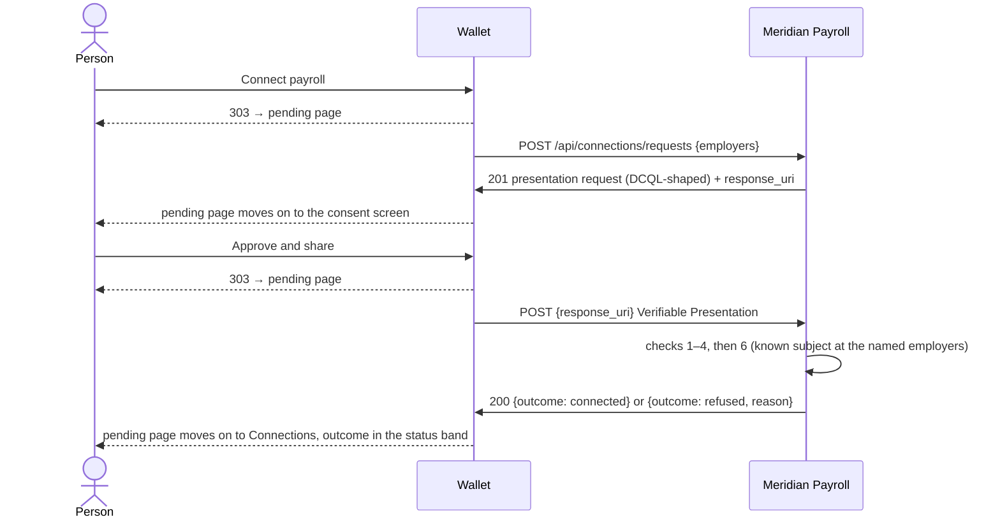

# Design: Loop 4 — Wallet and Payroll Connect

Technical design for [Intent 004](../../intents/004-wallet-and-payroll-connect.md), following
[decisions.md](../../decisions.md), the flow in [credential-model.md §1, Phases 1–2](../../credential-model.md#phase-2--connect-to-payroll),
and the Claude Design handoff in [design/loop-4/](README.md).

Covers the loop's four issues: #13 (Wallet employer lookup), #16 (Payroll receives the
connection request and verifies identity), #22 (Wallet consent screen) and #27 (where state
lives, plus per-person reset).

**Link, don't restate.** The flow and the verification checks are defined in
`credential-model.md` §1–2; the wording people see is in its §5 and in the handoff; component
names, tokens, copy and accessibility rules are in `design/loop-4/README.md` (cited below as
"handoff §N"). This document says what gets built, where, and what is still undecided.

Loop 3's design moves to `design/loop-3/design.md` as this one replaces it, per
[decisions.md](../../decisions.md).

## 1. Overview

For the first time, the Wallet and Payroll talk to each other, and both keep something they
learn while running. A person chooses their employer in the Wallet, asks to connect, sees what
Meridian Payroll is asking for, and approves or denies it. Payroll checks the identity credential
and links the connection to the employee record it already holds. The result shows on **both
apps'** Connections and Activity pages.

Four things arrive:

- **The Wallet keeps state (#13, #22).** Employers chosen, one connection per payroll provider,
  a request in progress, and an activity log, all per person and in memory (§2).
- **A two-call protocol (#16, #22).** The Wallet asks Payroll what it needs, then sends a
  presentation. Both are REST calls shaped after OpenID4VP, as
  [credential-model.md §4](../../credential-model.md#4-w3c-conformance--what-we-adopt-and-what-we-fake)
  plans (§3).
- **Payroll becomes a verifier (#16).** It gets its own trust list and its own copy of the four
  checks, plus check 6, "known subject". Its Connections and Activity pages become real (§7).
- **The first JavaScript in the project.** One inline script, about 15 lines, on the two pending
  pages only. It is progressive enhancement over pages that already work without it. Ed
  approved this rule change on 2026-09-22 (handoff §6, and §8 here).

**Payroll issues nothing this loop.** It has no keys of its own, no `/.well-known/jwks.json`
and no income credentials; those are Loop 5. Benefits and `tools/sample_data/` are untouched.

## 2. Where state lives (#27)

**Decided in Intent 004 (2026-09-22): runtime state is in memory, per app, and volatile.** There
is no database and nothing on disk. Render's free tier has no persistent disk, so a file would
buy nothing. Each app holds its own state in module-level dictionaries. It is lost whenever that
app restarts, whether from idle spin-down after about 15 minutes or from a redeploy.

Two things this means in code:

- **One process per app.** `render.yaml` starts one uvicorn worker with no `--workers` flag, so
  one set of dictionaries serves every request. Adding workers would split the state and break
  the flow, so don't do it while state is in memory. This goes in CLAUDE.md's "Things that look
  like mistakes" list.
- **Every state change happens inside a single event loop, with no `await` between reading and
  writing a record,** so concurrent requests can't interleave inside a change. The one place
  work spans an `await` is the Wallet's outbound call. It is guarded by a token rather than a
  lock (§5).

**What each app forgets, and what the person sees.** The apps idle independently, so one can
remember a connection the other has lost. That is a named limitation, and **nothing on screen
explains it** (handoff §7):

| Restart | Wallet shows | Payroll shows |
| --- | --- | --- |
| Wallet only | No employer chosen, empty Activity | Still connected |
| Payroll only | Still connected | Not connected, empty Activity |
| Both | No employer chosen | Not connected |

**No per-person reset is built, now or later** (Ed, 2026-09-22). Volatile state *is* the reset:
restarting an app returns everyone in it to their starting point. Within a session, **Remove**
already returns one person's Wallet to the start, and reconnecting simply overwrites Payroll's
record (§7). So any person can run the flow again at any time. The only thing that can't be
cleared on demand is Payroll still showing an earlier connection, which is cosmetic. #27 closes
when this decision is recorded in `decisions.md` (§12, step 1). No follow-up issue is opened.
This supersedes Intent 004's "belongs in its own later issue" (§13 item 10).

## 3. The protocol (#16, #22)

Two calls, both from the Wallet's server to Payroll's server. Payroll never calls the Wallet.



### Call 1: the connection request

`POST /api/connections/requests` with `{"employers": ["pinecrest"]}`: the ids of every employer
the Wallet holds under Meridian Payroll. Payroll records a pending request and replies `201`:

```json
{
  "requestId": "4b7c1e0a9f2d4c3b8a6e5d4c3b2a1f0e",
  "dcql_query": {
    "credentials": [
      {
        "id": "identity",
        "format": "vc+jwt",
        "meta": { "type_values": [["IdentityCredential"]] }
      }
    ]
  },
  "response_uri": "/api/connections/requests/4b7c1e0a9f2d4c3b8a6e5d4c3b2a1f0e/presentation"
}
```

- **Shaped after DCQL, not conformant to it.** The field names follow OpenID4VP's so a later
  move is a translation ([credential-model.md, Presentation requests](../../credential-model.md#presentation-requests)).
  The request is a **list**, as #22 requires.
- **The request names a credential type, not claims** (Ed, 2026-09-22). A signed credential
  can't be split: removing a claim breaks the signature, so Payroll receives the whole identity
  credential whatever it asks for. A request listing only name and date of birth would describe
  less than what actually changes hands, so the entry has no `claims` list. This is what the
  consent screen already shows: the whole credential, with nothing marked. This supersedes
  handoff known gap 2's assumption of name and date of birth. Asking for particular claims only
  becomes meaningful with selective disclosure (#28). Payroll links by `credentialSubject.id`.
  §13 item 1.
- **`response_uri` is a path, not an absolute URL.** The Wallet resolves it against the provider
  URL it already holds, and **refuses to send anything if the result lands on a different
  origin.** OpenID4VP uses an absolute URI. A path avoids building one behind Render's TLS
  proxy, where the request arrives as `http://` (the same reason `cred.css` is a literal
  `href`), and the origin check keeps a credential from going anywhere the Wallet didn't choose.
  §13 item 9.
- `400 {"error": "invalid_request"}` if `employers` is missing, empty, or names an unknown id.

### Call 2: the presentation

The Wallet POSTs the Verifiable Presentation from
[credential-model.md, Presentations](../../credential-model.md#presentations) to the resolved
`response_uri`. It is unsigned, and each credential travels as an
`EnvelopedVerifiableCredential` carrying **the exact JWT the Wallet holds**, byte for byte, a
tampered one included.

| Response | Meaning |
| --- | --- |
| `200 {"outcome": "connected"}` | Checks passed, and the employee record is linked |
| `200 {"outcome": "refused", "reason": "credential_invalid"}` | Any of checks 1–4 failed |
| `200 {"outcome": "refused", "reason": "not_an_employee"}` | Verified, but check 6 failed |
| `404 {"error": "unknown_request"}` | No such pending request: already answered, expired, or lost to a restart |
| `400 {"error": "invalid_presentation"}` | Not a VP, or not exactly one credential of the requested type |

A refusal is a `200`: Payroll processed the presentation and said no, which is not a protocol
error. The reason codes are credential-model §5's, and the Wallet composes every word the
person sees from them.

**Check 6, "known subject", is scoped to the named employers.** The subject must belong to an
employee record, **and that person must have paystubs at every employer the connection request
named.** Otherwise the answer is `not_an_employee`. Without the employer scope, the outcome can't
happen: Payroll has a record for all 25 people (handoff §4). With "every" rather than "any",
a wrong employer can't be connected by mistake alongside a right one, and it matches the band's
advice to "remove Meridian Payroll and find your employer again". §13 item 3. Employment comes
from the paystubs, its one home in Payroll (Loop 3 design §11 item 6).

Check 5, "one subject", holds trivially with one credential. It is implemented anyway, because
Benefits will send several.

### Timing and failure

- **One attempt per call, a 60-second timeout, no automatic retry.** A cold Payroll answered in
  22.5 seconds (Intent 004), and the pending copy promises "up to half a minute". 60 seconds
  leaves room without leaving a person stranded. The person's own **Try again** is the retry.
  Loop 2's retry-on-429 never once worked (Loop 3 design §7), so there's nothing to gain from
  building another.
- **Anything other than the responses above** (a timeout, a connection error, a `5xx`, a `404`
  on call 2, unparseable JSON) ends the attempt with the Wallet-side outcome **`no_response`**
  (§6, §13 item 2).
- **The Wallet identifies itself honestly** with `User-Agent: cred-demo-wallet`. It never
  disguises itself as a browser to get past Render's gate, for the reason Loop 3 design §7 gives.

## 4. Wallet data and state (#13)

### Committed data

```
apps/wallet/app/data/
├── employers.json   # new: byte-identical copy of tools/sample_data/generated/employers.json
└── providers.json   # new, hand-written: one payroll provider, its URL, the employers it pays
```

- **`employers.json` is a verbatim copy**, like Payroll's (Loop 3 design §2), with `id`, `name`,
  `industry` and `city`: exactly what a lookup row shows. It is copied once with `cp`, and
  checking it takes one `diff`. No generator is needed, so `tools/` stays unchanged for this
  file.
- **`providers.json`** carries what #13 lists as data: each employer's payroll provider, and
  where to reach it.

  ```json
  {
    "meridian": {
      "name": "Meridian Payroll",
      "url": "https://cred-demo-payroll.onrender.com",
      "employers": ["beacon", "boardwalk", "…all 15"]
    }
  }
  ```

  A test asserts that every employer appears under exactly one provider.
- **Running locally**, `MERIDIAN_PAYROLL_URL` overrides the URL (for example
  `http://localhost:8002`). It is read in one place, and Render sets nothing. The README's
  local-run section says so. The name is new on purpose, so it can't be mistaken for Loop 2's
  deleted `PAYROLL_URL`.

### Runtime state: `app/state.py`

Per person, created on first touch:

- **`links: dict[provider_id, Link]`**: one per payroll provider. There is one connection per
  provider, not per employer (handoff §1).
  - `employers`: ids, in the order they were added.
  - `connected_at`: set when Payroll confirms, otherwise `None`.
  - `outcome`: the last failed attempt's code (`credential_invalid`, `not_an_employee`,
    `no_response`), or `None`. Cleared by a success.
  - `shared_credential_id`: which credential the last attempt shared, for the band's **View
    your credential** link.
  - `request`: the attempt in progress, or `None` (§5).
- **`events`**: the Activity log, each entry a timestamp, a dot variant and the message text the
  Wallet composed when the event happened.

A link exists only while it has at least one employer. **Remove** and **Disconnect** delete it,
with everything in it. Disconnect **makes no call to Payroll** (handoff §1), so Payroll still
shows the wallet as connected. That is a named limitation.

## 5. The Wallet's side of a request (#22)

An attempt moves through phases. Each phase has its own page, and every page redirects to
wherever the attempt actually is:

| Phase | Entered when | Page | Mockup |
| --- | --- | --- | --- |
| `asking` | **Connect payroll** / **Try again** is POSTed | `/p/{id}/connections/{provider}/asking` | `pending.html` |
| `consent` | Payroll's request arrived and the Wallet holds everything asked for | `…/request` | `consent.html`, `consent-tampered.html` |
| `missing` | Payroll's request arrived and something asked for isn't held | `…/request` | `consent-missing.html` |
| `verifying` | **Approve and share** is POSTed | `…/verifying` | `pending-verify.html` |
| (done) | Payroll answered, or the call failed | `/p/{id}/connections` | the outcome band |

**The call runs outside the request that started it.** The POST records the phase, starts the
outbound call as a detached `asyncio` task through a small `spawn()` seam, and returns `303` to
the pending page at once. FastAPI's `BackgroundTasks` would work too, but it runs inside the
originating request's ASGI call, which ties a wait of up to a minute to that request. A detached
task makes the independence explicit. The seam also lets tests collect the task and run it when
they choose (§10), so they don't depend on timing.

**A token makes stale answers harmless.** Each attempt gets a fresh token. A task writes its
result only if its token still matches `link.request`, so an answer arriving after **Try
again**, **Remove** or **Disconnect** is dropped. This is the one invariant in the design that
isn't obvious from reading the code, and it gets a one-line comment in the source. Any
exception in the task ends the attempt as `no_response`, so no attempt is left in `asking` or
`verifying` forever. The 60-second timeout bounds how long that can take.

**Matching the request against the wallet.** For each entry in `dcql_query.credentials`, the
Wallet looks for a credential it holds whose `type` includes the requested type. It offers that
credential whatever its own badge says. Carmen's Tampered credential is offered, with its band
and caveat, so the demo can show the verifier catching it (handoff §3). If any entry has no
match, the phase is `missing`.

**Where Activity entries are written.** They are written at the transitions, never by a GET:

| Transition | Entry (handoff §5) | Dot |
| --- | --- | --- |
| POST connect | Connection to Meridian Payroll requested | neutral |
| request arrives, something missing | Connection to Meridian Payroll not made: you don't have an Identity credential to share. | caution |
| POST approve | Identity credential shared with Meridian Payroll | neutral |
| POST deny | Request from Meridian Payroll denied. Nothing was shared. | neutral |
| outcome `connected` | New connection to Meridian Payroll established | verified |
| outcome `credential_invalid` / `not_an_employee` | Connection to Meridian Payroll refused: {§5 message} | error / caution |
| outcome `no_response` | Connection to Meridian Payroll not made: Meridian Payroll didn't respond. | caution |

**Deny** and **Close request** clear the attempt and return to Connections **silently**. The
earlier state, including an earlier failure band, is left as it was (handoff §3). Leaving the
consent screen by its **Connections** back link abandons the attempt without recording a
decision. The next **Connect payroll** starts a fresh one.

**The status endpoint** is `GET …/{provider}/status?page=asking|verifying`. It returns
`{"next": null}` while the attempt is still in that phase, and otherwise `{"next": "<url>"}`: the
phase's page, or Connections once the attempt is done. It is what the pending script polls.

## 6. Wallet routes and screens (#13, #22)

| Method | Route | Does | Issue |
| --- | --- | --- | --- |
| GET | `/p/{id}/connections` | Connections, every state | #13, #22 |
| GET | `/p/{id}/connections/employers` | Employer lookup | #13 |
| POST | `/p/{id}/connections/employers` | Add `employer=<id>`, 303 → Connections | #13 |
| POST | `/p/{id}/connections/{provider}/remove` | Remove or Disconnect, 303 → Connections | #13 |
| POST | `/p/{id}/connections/{provider}/connect` | Start an attempt, 303 → `asking` | #22 |
| GET | `/p/{id}/connections/{provider}/asking` | Pending, waiting for the request | #22 |
| GET | `/p/{id}/connections/{provider}/request` | Consent or missing | #22 |
| POST | `/p/{id}/connections/{provider}/request` | `decision=approve\|deny\|close` | #22 |
| GET | `/p/{id}/connections/{provider}/verifying` | Pending, waiting for the verdict | #22 |
| GET | `/p/{id}/connections/{provider}/status` | JSON for the pending script | #22 |

- An unknown person, provider or employer id returns **404**, as Loop 2's routes do.
- Adding an employer who is already added changes nothing and still redirects. The lookup
  renders that row as `<button disabled>` anyway.
- A decision POSTed when no attempt is in the matching phase (a double-submit, or a stale tab)
  changes nothing and redirects to wherever the attempt is.
- **No nav item is current** on the lookup, consent or pending pages. They are steps inside a
  flow (handoff, Accessibility). Their footer's **Switch person** carries `?from=connections`,
  so switching mid-flow lands on the other person's Connections.

### Stylesheet and base template

`apps/wallet/app/static/cred.css` is replaced wholesale by `design/loop-4/wallet/cred.css`. Its
first 731 lines are byte-identical to the current file (checked, not assumed), so no existing
page can change. `base.html` gains an empty `` before `</body>`. Only the two
pending pages fill it.

### Connections: `connections*.html`

The heading and purpose line stay as they are. Below them, one of:

- **No employer chosen.** Loop 2's `.empty`, verbatim, with **Find your employer** now a real
  link to the lookup.
- **A provider panel** (handoff §2) for each link. There is only ever Meridian this loop. The
  status band appears only when there's something to say; the provider head carries **Remove**
  (not connected) or **Disconnect** (connected). The employers are listed **alphabetically**, as
  `connections-connected-p08.html` has them, not in the order they were added. **Connect
  payroll** appears while not connected, reading **Try again** after a failure. Below the panel
  is **Find another employer**.

The band, from `link.connected_at` and `link.outcome`:

| State | Band | Badge | Copy |
| --- | --- | --- | --- |
| connected | `--verified` | ✓ Connected | Connected since {22 Sep 2026, 2:14 PM}. Meridian Payroll can send you credentials for every employer below. |
| `credential_invalid` | `--error` | ✕ Not connected | Meridian Payroll couldn't verify your identity credential. / It has been changed since it was issued. *View your credential* |
| `not_an_employee` | `--caution` | ! Not connected | Meridian Payroll doesn't have an employee record that matches you. / Check that you chose the right employer. If not, remove Meridian Payroll and find your employer again. |
| `no_response` | `--caution` | ! Not connected | Meridian Payroll didn't respond. / Try again in a minute. *(no mockup; copy approved by Ed, §13 item 2)* |

**The second sentence of `credential_invalid` depends on the Wallet's own check.** It appears
only when the Wallet's own verification of the credential it shared says **Tampered**, and
*View your credential* links to that credential's detail page. If Payroll refuses a credential
the Wallet considers Verified (a trust-list mismatch between the apps, say), only the first
sentence shows. That way the screen never claims tampering the Wallet can't see itself.

The outcome table lives in `app/outcomes.py`, beside Loop 2's `PRESENTATIONS`, in the same
shape: a code maps to a band variant, glyph, label, sentences and dot. The copy is in one place.

### Employer lookup: `employers.html`, `employers-p08.html`

The `.back` link reads **Connections**; the eyebrow is **Connections**, and the `<h1>` is **Find
your employer**. Then all 15 employers, A–Z by name. Each is a
`<button class="employers__row" name="employer" value="{id}">` in its own POST form, reading
"{industry} · {city}, NJ". An employer already added shows the neutral **– Added** badge in
place of the chevron, and its button is `disabled` (handoff §8). ", NJ" is one literal constant,
for the reason Loop 3 design §11 item 8 gives.

### Pending: `pending.html`, `pending-verify.html`

Verbatim from the mockups (handoff §6). The `role="status"` box carries
`data-poll="/p/{id}/connections/{provider}/status?page=asking"` (or `verifying`). **Check
again** is a GET form whose `action` is **the page's own URL**, which redirects if the attempt
has moved on. That is the mockup's intent ("returns either this page again or the next step"),
without the page needing to know what comes next. The script is §8's.

### Consent: `consent.html`, `consent-tampered.html`, `consent-missing.html`

- The eyebrow is **Request from {provider}**. The `<h1>` and `<title>` are **{provider} is
  asking for {n} credential(s)**, where `n` is the length of `dcql_query.credentials`.
- **Purpose:** "It runs payroll for {employers}, and needs to check who you are before it links
  your wallet to your employee record." `{employers}` names **every employer in the request**,
  joined "A, B and C". For 20 of the 25 people that's one name, identical to the mockup (§13
  item 4).
- **An `<ol class="request">` with one `.request__item` per requested credential.** Its head is
  the type ("Identity credential") with **"i of n"**, or **Missing**. Its body is either **the
  credential panel exactly as the detail page draws it**, or the `.category__waiting-note` "You
  don't have an {Identity credential} to share."
- **The panel is shared with `credential.html`, not copied.** It moves into an include,
  `_credential_panel.html`, parameterized by heading level and id prefix. The detail page passes
  `h2`/`status`; the consent screen passes `h3`/`r{i}` (handoff §3's one adaptation). The
  detail page's rendered HTML must not change, and a test pins it.
- **One `<form class="decision">` after the list.** With nothing missing: "This applies to the
  whole request." and **Approve and share** / **Deny**. With anything missing: "Without it, this
  request can't be completed, and nothing is shared." and **Close request** alone.
- The `.back` link reads **Connections** (see §5 on abandoning).

### Activity: `activity*.html`

Loop 2's fixed sample day gives way to the real log. Entries are grouped by day, newest day
first and newest first within a day, under a mono day heading ("Tuesday 22 September"). Each
entry is the Loop 2 `.log__item` with its time ("2:14 PM") and a `log__dot--{variant}` (handoff
§5). **Empty state (no mockup; copy approved by Ed, §13 item 5):** the `.empty` pattern with no button, reading
"Nothing has happened in your wallet yet. Finding your employer will be the first entry.". It
mirrors Payroll's designed empty state.

### Credentials home: `credentials.html`

One conditional sentence. Once connected, the Income note reads "You're connected to Meridian
Payroll. Your pay will appear here as credentials once it starts sending them." Otherwise it
keeps Loop 2's wording (handoff §9). Nothing else on the page changes.

### Times and dates

Every time is shown in **America/New_York**. Every employer and 18 of the 21 valid credentials
are in New Jersey, and times in UTC would read four hours off to anyone watching. The helpers
live in `display.py`: `when()` gives "22 Sep 2026, 2:14 PM", `time_of_day()` "2:14 PM", and
`day_heading()` "Tuesday 22 September". Hours carry no leading zero. Each app keeps its own copy.

## 7. Payroll becomes a verifier (#16)

### Trust list

`apps/payroll/app/data/trust.json`: the four states, `trustedFor: ["IdentityCredential"]`, and
their public keys. That is exactly the "Payroll trusts the four states" row in
[credential-model.md §2](../../credential-model.md#2-trust--issuers-keys-and-verification).

**Its content today is byte-identical to the Wallet's `trust.json`,** because the Wallet also
trusts only the states until Loop 5 adds Payroll. So the file is created by copying the Wallet's
and checking it with a `diff`. **`tools/generate_credentials.py` also learns to write it.**
credential-model §2 promises that one script regenerates "every app's trust list". Without this,
the next run of the script would re-key the Wallet and silently leave Payroll trusting the old
keys: every identity credential would come back `credential_invalid`. The script is **not run**
this loop, because running it re-keys and re-signs every committed credential for nothing.
§13 item 7.

### Verification: `app/verify.py`, `app/presentation.py`

- **`verify.py` is Payroll's own copy of the Wallet's**: the four ordered checks, the same
  `Outcome` enum and the same PyJWT calls. Per the monorepo rule it is copied, not imported. Any
  outcome other than `VERIFIED` becomes `credential_invalid`; credential-model §5 has one
  Payroll code for all four failures.
- **`presentation.py`** parses the VP, requires exactly one `EnvelopedVerifiableCredential`
  whose `id` is a `data:application/vc+jwt,` URL and whose type matches the request, then runs
  checks 1–4, 5 and 6 (§3). It returns the linked person, or a reason.
- `app/clock.py`, the same seam as the Wallet's, so check 4 and every timestamp are testable
  without today's date.

### Runtime state: `app/connections.py`

- **`pending`**: `requestId` → the named employers and a creation time. Each request is
  **one-shot**: answering it removes it. Entries older than **15 minutes** are pruned whenever a
  new request arrives. The endpoint is public and unauthenticated, and the pruning bounds its
  memory without a background job.
- **`connections`**: person id → `connected_at` and the verifying issuer's name. Connecting again
  overwrites the record. Nothing ever deletes it except a restart, because Wallet's Disconnect
  doesn't call Payroll (§4).
- **`events`**: person id → Activity entries. **Only successful connections are logged**
  (handoff §5). A credential that fails verification hasn't identified anyone, so there's no
  person to attach it to.

### Routes

| Method | Route | Does |
| --- | --- | --- |
| POST | `/api/connections/requests` | Call 1 (§3) |
| POST | `/api/connections/requests/{request_id}/presentation` | Call 2 (§3) |
| GET | `/p/{id}/connections` | Connections: `connections.html`, `connections-connected.html` |
| GET | `/p/{id}/activity` | Activity: `activity.html`, `activity-empty.html` |

The portal nav's **Connections** and **Activity** become real links, with `aria-current="page"`
on each page in both the inline nav and the `<details>` panel. `PORTAL_NAV`'s `#` hrefs go.

### Screens

Copy, classes and ARIA are verbatim from `design/loop-4/payroll/`. `cred.css` is replaced
wholesale; its first 613 lines are byte-identical to the current file (checked).

- **Connections.** The eyebrow is **Your account**, the `<h1>` is **Connections**, then the
  purpose line. Not connected: `.empty` with no button (handoff §10). Connected: one
  `.connlist__row` reading **Your wallet**, "Identity verified with {the State of New Jersey} ·
  since {22 Sep 2026, 2:14 PM}", and the ✓ Connected badge. The page is binary and never a list
  of several connections.
- **Activity.** The same `.log` format and day grouping as the Wallet. One entry kind: "New
  connection from your wallet established", with a verified dot. The empty state reads "Nothing
  has happened on your account yet. Connecting your wallet will be the first entry."
- **The landing page's "Coming soon" wallet card is removed** (handoff, known gap 3). Its copy,
  "You will be able to connect a credential wallet here", is now wrong: connecting starts in the
  Wallet. §13 item 8.
- **The person switcher gains `?from=`,** as Loop 3 design §11 item 9 planned "when it adds a
  second destination". It takes `paystubs|connections|activity` (anything else means
  `paystubs`), rows link to that screen, and the aside reads **Back to {screen}**. That is the
  Wallet's mechanism, and it leaves "Back to paystubs" verbatim for the default.
- `issuer_phrase()` ("the State of New Jersey" but "Meridian Payroll") is copied into Payroll's
  `display.py` alongside the time helpers from §6.

## 8. JavaScript, allowed sparingly

**The rule, as Ed approved it on 2026-09-22 (handoff §6):** JavaScript is allowed sparingly,
only where a no-JS option is insufficient, as progressive enhancement over a page that already
works without it. No framework, no library, no bundler.

**The only use is the pending pages' inline script**, taken verbatim from `pending.html`. It
runs only when `data-poll` is set. It hides **Check again**, polls every 2 seconds, calls
`location.replace(next)` when the status endpoint says so, and shows Check again again after 45
seconds. Without JavaScript the pages work unchanged: Check again is an ordinary GET. The handoff
explains why this beats `<meta refresh>` (WCAG F41) and a long-held POST.

`decisions.md` records the rule. CLAUDE.md's "No JavaScript and no bundler, anywhere in these
pages" becomes the amended rule, and its "Things that look like mistakes" list gains the inline
`<script>` on the two pending pages. Both edits land with this design (§12, step 1). A test
pins the scope: exactly those two pages contain a `<script>`, and no page loads a script from a
URL.

## 9. The Render-origin gate: test before building the second half

Loop 3's retro asked for this to be confirmed **early**, and Intent 004 asks for it "before
calling the flow done". The question is whether Render lets one free service's request wake, or
even reach, another. Loop 3 found automated pings to a *sleeping* service gated, and never
tested a *warm* one.

**Why it's worth testing early.** If Render gates warm requests too, server-to-server calls are
the wrong architecture, not the wrong copy. The alternative is **browser-mediated**: the Wallet
sends the person's browser to Payroll carrying the request, the way OpenID4VP's same-device flow
does, so every hop is a real browser visit. That would reshape #22's second half. So #22 is
built in two PRs, split at the protocol's two calls (§12), and the test runs between them:

1. **Warm, blocking.** Visit Payroll, then the Wallet, directly. Choose Pinecrest as Grace
   Okafor and press **Connect payroll**. **Pass:** the consent screen arrives, and Payroll's
   Render log shows the inbound `POST /api/connections/requests`. Run it twice. **If this
   fails,** stop and redesign with Ed before building #22's second PR.
2. **Cold, informative.** Let Payroll idle for more than 15 minutes, wake only the Wallet, and
   connect. **Pass:** the consent screen arrives within the timeout. **If it's gated,** the
   attempt ends as `no_response`, which is the honest outcome, and the README's existing advice
   (visit each app before a demo) already covers it. Record which happened in §13. Don't
   engineer around it.

Nothing about this test relies on documentation this project hasn't read. The result is what
Render actually did, captured in both apps' logs, in the way Loop 3's #48 retest was.

## 10. Tests

Per app, from inside the app's directory. **No test reaches the network or depends on today's
date.** An autouse fixture resets each app's in-memory state between tests.

**Wallet.** Outbound calls go through `httpx.MockTransport`, and `spawn()` is replaced by a
collector, so a test decides when a background call runs.

| Area | Cases |
| --- | --- |
| Data | `employers.json` holds 15 records with `id/name/industry/city`; every employer sits under exactly one provider; the provider URL is `https` |
| Lookup | 15 rows A–Z, each a POST button with the employer id; an added employer is `disabled` with **– Added**; `.back` goes to Connections |
| Add / remove | Adding leads to the chosen state with **Remove** and Connect payroll, plus an Activity entry; adding twice leaves one entry; Remove empties the page and logs "Meridian Payroll removed, with {employers}"; Disconnect logs "Disconnected from Meridian Payroll"; an unknown employer or provider returns 404 |
| Connected | The verified band with the time in New York, **Disconnect**, no Connect button, employers A–Z (p08's three in the mockup's order) |
| Outcomes | Each of the four bands, with glyph, label and copy; **Try again** after each failure; the Tampered second sentence and its link only when the Wallet's own check says Tampered |
| Request | Connect gives `asking`; the collected task plus a mocked `201` gives `consent` (p01, p23) or `missing` (p24, p25, plus its caution entry); timeout, `5xx`, bad JSON, or a `response_uri` on another origin each give `no_response`, and in the last case nothing is sent |
| Consent | p01: the h1, "1 of 1", the purpose naming Pinecrest Home Care, the panel, Approve and Deny in one form. p23: the Tampered band and caveat, Approve still there. p24: **Missing**, the note, **Close request** only. p08 with three employers: the purpose names all three |
| Decision | Approve sends a VP whose one enveloped credential is the committed JWT exactly; each Payroll answer becomes its outcome; deny and close change no band; a stale token's answer is dropped; a double-submitted decision changes nothing |
| Pending | `role="status"`, `data-poll` set to the status URL, Check again a GET to the page itself, the script present; each pending URL redirects once its phase has passed; status JSON for each phase |
| Activity | Newest first, one day heading per day, dot variants per §5; empty state for a fresh person |
| Home | The connected Income note versus Loop 2's |
| Detail page | `credential.html`'s rendered output unchanged by the include refactor |
| All pages | Only the two pending pages contain `<script>`; none has `<script src`; `/static/cred.css` is literal |

**Payroll.** Tests mint **throwaway ES256 keys** and a test trust list at test time, plus a
signed identity credential and a tampered copy. Nothing reads the Wallet's files.

| Area | Cases |
| --- | --- |
| Trust list | Four states, each `trustedFor` exactly `["IdentityCredential"]`, each with one P-256 key |
| Call 1 | `201` with `requestId`, one DCQL entry for `IdentityCredential` with no `claims` list, a path-only `response_uri`; `400` for missing, empty or unknown employers |
| Call 2 | Valid, at the right employer: connected. Tampered: `credential_invalid`. Unknown issuer, expired, not yet valid: `credential_invalid`. Verified at the wrong employer: `not_an_employee`. Right plus wrong employer: `not_an_employee`. Unknown subject: `not_an_employee`. Answered twice: `404` the second time. Older than 15 minutes: `404`. Not a VP, or two credentials: `400` |
| Link | A connection records the time and "State of New Jersey"; a failed one records nothing, on either page |
| Pages | Connections, empty and connected, verbatim; Activity, empty and with one entry; nav `aria-current` on each; the landing page has no wallet card; the switcher's `?from=` for all three screens plus an unknown value |
| All pages | Still no `<script>` anywhere in Payroll |

**All three apps.** `/health` returns `{"status": "ok"}`; `/static/cred.css` is served from that
app's own copy.

## 11. Dependencies, configuration and deployment

Checked against this machine (an Intel Mac with no Homebrew), the check Loop 2's retro asked
for:

| Change | Where | Installs here? |
| --- | --- | --- |
| `pyjwt[crypto]>=2.9`, `cryptography<49` | Payroll, runtime | Yes: the same pins the Wallet has installed since Loop 2 |
| `httpx` dev → runtime | Wallet | Yes: already locked; Loop 3 only moved its group |
| `tzdata` | Wallet and Payroll, runtime | Yes: pure Python, a universal wheel |
| `python-multipart` | Wallet, runtime | Yes: pure Python. Not foreseen here — added at build time (§13 item 18) |

`tzdata` is there because `zoneinfo` needs a time zone database, and nothing checked here
establishes that Render's Python runtime ships one. With `tzdata` installed, that stops mattering.

| Unchanged | Why it is worth saying |
| --- | --- |
| `render.yaml` | No env vars. The Wallet reads Payroll's URL from `providers.json`. One worker (§2) |
| `.github/workflows/ci.yml` | No `paths:` filters, no cancellation on `main`, `ci-passed` still the one required check |
| `tools/sample_data/`, `docs/sample-data.md` | No new or changed sample data |
| Benefits | Nothing |

**Deploy scope.** #13 and #22 touch only `apps/wallet/**`, so only the Wallet redeploys. #16
touches `apps/payroll/**` plus `tools/generate_credentials.py`, so only Payroll redeploys. The
docs PR redeploys nothing.

## 12. Build order

Per-item PRs to `main`, one branch each. A closing keyword goes only in the PR that finishes its
issue.

1. **This design, plus #27's decision.** `docs/design.md` (and the Loop 3 archive); in
   `decisions.md`, the in-memory state decision, no reset feature, and the JavaScript rule;
   CLAUDE.md's two edits (§2, §8); and `credential-model.md` aligned with "the whole credential
   is requested" (§13 item 1). Closes #27. Docs only; nothing redeploys.
2. **#13: Wallet employer lookup.** The data files, `state.py`, the Loop 4 `cred.css`, the
   lookup, add/remove, every Connections state that doesn't need Payroll (empty, chosen,
   connected and the bands, rendered from state set up in tests), the real Activity log and its
   empty state, and the time helpers. **Connect payroll** renders as the mockup has it but as a
   `type="button"` outside any form. #13 says it "does nothing at this point".
3. **#16: Payroll verifies.** Its trust list and the generator change, the new dependencies,
   `verify.py`, `presentation.py`, `connections.py`, both API calls, the Connections and
   Activity pages, the nav, the switcher's `?from=`, and the removed wallet card.
4. **#22, first PR ("Part of #22"): call 1.** Connect payroll becomes a real form; `spawn()`,
   the `asking` page and its script, the status endpoint, the consent screen in all three
   variants with the shared panel include, and Deny and Close. **Approve and share** renders as
   designed but as a `type="button"` until the next PR.
5. **The Render-origin test (§9).** Stop here if the warm case fails.
6. **#22, second PR: call 2.** Approve, the presentation, `verifying`, every outcome, the
   connected state reached for real, and the Credentials home note. Closes #22.

#13 comes first because #22 builds on its state. #16 precedes #22 so the first real call has
something live to reach. The split in #22 puts §9's test after the first server-to-server call
and before the second is built.

## 13. Decisions and deviations

The reconciliation pass (Loop 2's improvement, kept since): each mockup checked against the
text, each acceptance criterion against its mechanism, and each dependency against Ed's machine.
Items 1, 2, 5 and 10 were put to Ed and answered on 2026-09-22. The rest are settled here, with
reasons, and can be overruled.

1. **Decided (Ed): the whole credential is requested, and no claims are marked.** Handoff §3
   draws the consent screen with nothing marked. That contradicted
   [credential-model.md §1 step 3](../../credential-model.md#phase-2--connect-to-payroll), its §3
   decision 1, its [Presentation requests](../../credential-model.md#presentation-requests)
   paragraph, issue #22 and brief §4, which all describe a request naming particular claims and
   a screen marking them. Ed chose the handoff, for a reason that goes further than the screen:
   a signed credential can't be split, so a request for "name and date of birth" describes less
   than what Payroll actually receives. The request therefore names the credential type alone
   (§3). Marking claims only becomes meaningful with selective disclosure (#28); that question,
   and what it means for Benefits, is for a later loop. credential-model.md's three passages are
   updated in step 1 of §12. #22's body still says "marking the ones the requester says it
   needs". Ed owns the issues, so that edit is his.
2. **Decided (Ed): the `no_response` outcome's copy.** Handoff §6 leaves a "Meridian Payroll
   isn't responding" state undrawn, and says it would reuse the caution band. A timeout can
   happen whatever §9 finds, so it lands where every outcome lands (handoff §2): the caution
   band, "! Not connected", "Meridian Payroll didn't respond." / "Try again in a minute.", and a
   caution Activity entry. The copy says nothing about *why*, consistent with brief §4.
3. **Check 6 requires *every* named employer** (§3). Handoff §4 flags this as a reconciliation
   item without choosing. "Any" would let a wrong employer ride along with a right one, which
   contradicts the band's own advice.
4. **The consent purpose line names every employer in the request,** not only the latest added.
   Handoff §3 suggests the latest and calls it "the one wording case left for build". Payroll
   checks every named employer (item 3), so the sentence should name what's actually being
   checked. The result is identical for the 20 single-employer people.
5. **Decided (Ed): the Wallet's Activity empty state.** Before Loop 4, Activity never rendered
   empty; the placeholder had a fixed entry. §6 uses Payroll's designed pattern with Wallet copy.
6. **#13's issue text is superseded by the handoff in two places,** both Ed's decisions
   (handoff §1, 2026-09-22). There is no ✕ on each employer; Remove and Disconnect sit on the
   provider instead. And employers sit under the provider panel, not under an "employment
   section heading". #13's body isn't edited here: Ed owns the issues.
7. **Divergence from Intent 004: `tools/` changes.** The intent lists `tools/` as unaffected.
   `generate_credentials.py` gains one output, Payroll's trust list (§7), to keep credential-model
   §2's promise and to prevent a silent re-key mismatch. It regenerates nothing and isn't run
   this loop. This parallels Loop 3 design §11 item 1, which Ed agreed to.
8. **Payroll's "Coming soon" wallet card is removed** rather than relinked (handoff, known gap
   3). A card pointing at Connections would duplicate the nav item beside it, and its copy is
   wrong now. Loop 5 can add something back if issuance wants a place on that page.
9. **`response_uri` is a path, checked for same origin** (§3). This departs from OpenID4VP's
   absolute URI, for the TLS-proxy reason CLAUDE.md already records for `cred.css`. It's a
   stand-in (credential-model §4), not a contrary approach: resolving it gives an absolute URI.
10. **Decided (Ed): no per-person reset feature.** Intent 004 deferred reset to "its own later
    issue". Ed dropped it instead: restarts already reset each app, and §2 shows any person can
    run the flow again without one. No issue is opened. **Worth rechecking at Loop 6:**
    credential-model Phase 4 step 9 stops offering *Find government services* once a person
    holds benefit credentials. That makes the first state change with no in-app way back, short
    of waiting for the Wallet to idle or redeploying it.
11. **A lost connection looks like no connection** (handoff §7, adopted as proposed). This
    answers Intent 004's second open question. Revisit only if state ever becomes persistent.
12. **Disconnect doesn't tell Payroll,** so Payroll stays connected afterwards (handoff §1). It's
    a named limitation, like item 11, and changes nothing Loop 5 needs.
13. **Adding an employer after connecting joins the connection unchecked** (handoff §1). Payroll
    never hears about it, so Grace could add Harborline to a live connection. That's accepted
    for the demo. Loop 5's issuance follows Payroll's own records, so no credential results from
    it.
14. **The consent panel becomes an include shared with the detail page** (§6), rather than a
    second copy that could drift. A test pins the detail page's output.
15. **Times are shown in New York, with `tzdata` pinned** (§6, §11). The mockups' "22 Sep 2026,
    2:14 PM" is a New York afternoon.
16. **No automatic retry** on either call (§3). Loop 2's retry never succeeded, and a retried POST
    needs idempotency arguments the demo doesn't need to have.
17. **The Render gate result, run 2026-09-22/23 (§9).** **Warm: pass, twice.** With both
    services already warm (visited directly first, per the test's own procedure), pressing
    **Connect payroll** as Grace Okafor reached the consent screen immediately, run twice in a
    row. Server-to-server calls between warm Render free-tier services are not gated.
    **Cold: gated, fast.** With the Wallet woken but Payroll left idle past 15 minutes, the
    same attempt ended as `no_response` in about **two seconds** — not the 60-second timeout,
    and far short of the ~22-second cold start a direct visit to Payroll's own `/health` took
    moments later. That gap is the signal: the request never reached a slowly waking Payroll,
    it was refused fast, the same shape Loop 3's peer-wake pings hit (design/loop-3/design.md
    §7). Nothing here contradicts §9's decision to build server-to-server regardless — the
    warm path is what the demo actually uses, since the README already asks a visitor to open
    all three apps first. The cold case is the honest, undramatic outcome the design chose:
    `no_response`, "Try again in a minute," and the demo's existing advice covers the rest. Not
    engineered around, per §9.
18. **Two build-time gaps the reconciliation pass missed, both caught while building #13.**
    §4 says the Wallet's `MERIDIAN_PAYROLL_URL` override is documented in "the README's
    local-run section" — the README had no such section yet. #13 adds a short one. Separately,
    §11's dependency table didn't foresee `python-multipart`, which FastAPI's `Form()` needs
    for every POST the employer lookup and connection flow use; it installs cleanly on this
    Intel Mac (pure Python), so the gap was in the check, not the dependency.

## 14. Acceptance criteria

1. `docs/decisions.md` records that runtime state is in memory, per app and volatile, with no
   reset feature because restarts are the reset (#27), and the amended JavaScript rule.
   CLAUDE.md's JavaScript line is amended, and its "Things that look like mistakes" list names
   the pending pages' inline script and the single-worker requirement. `credential-model.md` no
   longer describes requests naming particular claims or a consent screen marking them. #27 is
   closed.
2. The Wallet's `employers.json` is byte-identical to `tools/sample_data/generated/employers.json`.
   `providers.json` names Meridian Payroll at `https://cred-demo-payroll.onrender.com` and places
   every one of the 15 employers under it exactly once. `MERIDIAN_PAYROLL_URL` overrides the URL
   locally, and Render sets no env var. No app reads or imports anything outside its own directory.
3. Connections with no employer shows Loop 2's `.empty`, with **Find your employer** as a working
   link to `/p/{id}/connections/employers`.
4. The lookup lists all 15 employers A–Z, each a 60px full-width POST button showing name and
   "{industry} · {city}, NJ". An employer already added is a `disabled` button with **– Added**.
   Choosing one returns to Connections with the Meridian Payroll panel, that employer in its
   list, **Remove**, **Connect payroll** and **Find another employer**. Activity gains "{Employer}
   added, paid through Meridian Payroll".
5. **Remove** (before connecting) and **Disconnect** (after) each clear the provider and its
   employers, return to the empty state, log "Meridian Payroll removed, with {employers}" or
   "Disconnected from Meridian Payroll", and make no call to Payroll.
6. **Connect payroll** POSTs, returns `303` to the `asking` page at once, and sends Payroll one
   `POST /api/connections/requests` naming every employer under the provider. Activity gains
   "Connection to Meridian Payroll requested".
7. Both pending pages match their mockups verbatim: a `role="status"` box with `data-poll` set,
   the "up to half a minute" copy, and **Check again** as a GET to the page's own URL. They work
   with JavaScript disabled, and with it enabled they move on by themselves. A slow first
   response (up to 60 seconds) reads as progress, not failure.
8. Payroll's reply is a DCQL-shaped presentation request: one entry for `IdentityCredential`
   with no `claims` list (the whole credential is requested), and a path-only `response_uri`.
   The Wallet sends nothing if that path resolves off Payroll's origin.
9. For the 23 people holding an identity credential (21 Verified, 2 Tampered), the consent screen shows "Meridian Payroll
   is asking for 1 credential", a purpose line naming every employer in the request, an `<ol>`
   with one item headed "Identity credential · 1 of 1", the credential drawn exactly as its
   detail page draws it (every claim, validity and the details disclosure), and one form with
   **Approve and share** and **Deny** under "This applies to the whole request." Carmen Diaz
   (p23) and the other Tampered holder (p22) see the Tampered band and caveat, with Approve still
   offered.
10. Ray Miller (p24) and Megan Doyle (p25) can choose an employer. On connecting they reach the
    missing variant: item head **Missing**, "You don't have an Identity credential to share.",
    no Approve button, and **Close request** alone. Activity gains the caution entry
    "Connection to Meridian Payroll not made: you don't have an Identity credential to share."
11. **Deny** and **Close request** return to Connections with its earlier state unchanged, and
    nothing is sent to Payroll. Deny logs "Request from Meridian Payroll denied. Nothing was
    shared."
12. **Approve and share** logs "Identity credential shared with Meridian Payroll", shows the
    `verifying` page, and POSTs a Verifiable Presentation whose single
    `EnvelopedVerifiableCredential` carries the Wallet's committed JWT byte for byte.
13. Payroll verifies with checks 1–4 against its own `trust.json` (the four states, trusted for
    `IdentityCredential` only), then check 6: the subject is an employee with paystubs at
    **every** named employer. It answers `connected`, `credential_invalid` or `not_an_employee`.
    Requests are one-shot and expire after 15 minutes, and a forgotten one returns `404`.
14. **Done, per Intent 004:** every one of the 25 people reaches exactly one correct result.
    - The 21 holders of a Verified credential who choose their own employer(s) connect. That
      includes the Michigan, New York and Ohio holders, and p06, p07, p08, p17's multi-employer
      cases.
    - p22 and p23 are refused with `credential_invalid`.
    - p24 and p25 hit the missing state.
    - Any verified holder who names an employer they don't work at (Grace Okafor choosing
      Harborline Logistics) is refused with `not_an_employee`.
15. The Wallet shows each result in the provider panel's status band, as the table in §6 sets
    out: Connected (verified), `credential_invalid` (error, with the Tampered sentence and
    **View your credential** only when the Wallet's own check says Tampered), `not_an_employee`
    (caution), and `no_response` (caution). Every failure changes the button to **Try again**.
    Each outcome writes its Activity entry with the matching dot.
16. Once connected, the Wallet panel reads "Connected since {date, time in New York}" with
    **Disconnect** and no Connect button, and lists the employers A–Z. The Credentials home's
    Income note reads "You're connected to Meridian Payroll. Your pay will appear here as
    credentials once it starts sending them." **Find another employer** adds to the live
    connection without a new request.
17. A timeout, connection error, `5xx`, unexpected `404` or unreadable reply ends the attempt as
    `no_response` within 60 seconds. No attempt is ever left pending. An answer that arrives
    after **Try again**, **Remove** or **Disconnect** changes nothing.
18. The Wallet's Activity lists real events grouped by day, newest first, with the handoff's
    wording, a `log__dot--{neutral|verified|caution|error}` per entry, and an empty state for a
    person with no events.
19. Payroll's **Connections** and **Activity** nav items are real routes with `aria-current`.
    Connections shows the handoff's `.empty` (no button) or one `.connlist__row`: "Your wallet",
    "Identity verified with {the issuing state} · since {date, time}", and ✓ Connected. Activity
    shows "New connection from your wallet established" with a verified dot for each successful
    connection, and its designed empty state otherwise. Failed attempts appear on neither page.
20. Payroll's landing page no longer shows the "Coming soon" wallet card. Payroll's switcher
    honours `?from=paystubs|connections|activity`, and its aside reads "Back to {screen}".
21. The only JavaScript in any app is the inline pending-page script, on the Wallet's two pending
    pages. No page loads a script from a URL, and nothing uses a framework or a bundler.
22. Every new or changed screen matches its `design/loop-4/` mockup and screenshot (copy, class
    names and ARIA verbatim) at desktop width and at the 40rem `<details>` breakpoint. Each
    app's `cred.css` is the handoff's, a strict superset of the previous file. Deviations are
    limited to those recorded in §13.
23. `tools/generate_credentials.py` writes Payroll's `trust.json` alongside the Wallet's. It
    isn't run this loop, and Payroll's committed `trust.json` is byte-identical to the Wallet's.
24. `uv run pytest` passes in all three app directories, and `ci-passed` is green. No test
    reaches the network or depends on today's date. Every new dependency installs on this Intel
    Mac without a compiler.
25. On Render, the warm-case test in §9 passes twice. Its result, and the cold case's, is
    recorded in §13 item 17. A merge touching only one app's directory redeploys only that app,
    and every page is served fully styled over HTTPS with no mixed-content warning.
